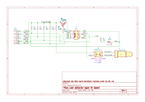

# Example installation

This is a high-level guide for an example espleak installation. You may need to adapt depending on your specific
situation; in particular the resistor pull-ups on I2C. This particular setup with the values on the schematic have been
tested successfully at 150KHz bus speeds with a 60ft CAT6 cable, but it should be able to go longer.

## Bill of materials

 * [Bulldog water valve actuator](https://www.econetshop.com/bulldog.html), with battery backup and outdoor kit (ODK-2)
 * If needed for extending the valve actuator cable: [PS/2 extension](https://www.amazon.com/dp/B092S5HY19)
   and [waterproof junction box](https://www.amazon.com/dp/B07TFSLLBY)
 * [2.5mm TS cable, right-angle](https://www.amazon.com/dp/B0D4Q8QTM7) for interfacing with the Bulldog controller
 * Breadboard, 2N3906 PNP transistor, optoisolator, several through-hole resistors, LED (see schematic)
 * [ESP32-POE-ISO-16MB-IND](https://www.olimex.com/Products/IoT/ESP32/ESP32-POE-ISO/)
 * Bulk direct-burial CAT6 cable
 * [PCA9515A I2C repeater module](https://www.amazon.com/dp/B0BG2BLKVJ) (2 total)
 * [QMC5883L modules](https://www.olimex.com/Products/Modules/Sensors/MOD-HMC5883L/) (2x)
 * Sensor waterproofing, e.g. [1" diameter 4:1 adhesive-lined heat shrink tubing](https://www.amazon.com/dp/B0B616X94M)

## Overview

The ESP32 board lives with the Bulldog controller and backup battery in the weatherproof box. An IO board provides the
interfacing between the ESP32 and the Bulldog controller (via an optoisolator and the 2.5mm TS cable), as well as an LED
for status. The IO board also provides the power switch and stronger pull-up resistors for the two sensors, which
connect via a single CAT6 cable.

Each sensor is attached directly to its own PCA9515A I2C repeater, which provides significantly higher drive strength,
allowing for faster speeds over longer distances than the QMC5883L is capable of by itself. The PCA9515A boards connect
to the CAT6 cable.

CAT6 cables have four sets of two twisted wires. Each sensor gets two twisted pairs. SDA and +3.3V are on one pair, SCL
and GND on the other. This works decently enough to mitigate noise issues thanks to the capacitors at either end. If
noise does cause failures in the sensing, the system can recover by resetting the sensors.

The pair of sensors with PCA9515A boards attached are enclosed in a single piece of heat shrink tubing for both
waterproofing and placement rigidity. The assembly is zip-tied to the water meter in the appropriate location.

## IO board

The IO board is pretty simple and can be built up on a breadboard or other prototyping aid.

Note that if you are not using the PCA9515A, you should not have anything stronger than 2.2K total pull-up resistance on
the I2C lines. The QMC5883L by itself is only rated for 1mA of drive strength (whereas the PCA9515A can do 6mA). This
will limit you to 12ft or so of CAT6.

## Cabling

Running the cable between the controller box and the water meter can be tricky and a fair bit of work. You may need to
dig a trench in your yard to bury the cable. Aim for at least 3" deep; if you have professionally-installed landscape
wiring already, you can use that as a reference for the proper depth. If you have to go under the sidewalk to get to
your meter, you may need to use a long cable drill bit to guide the cable through.

Leave enough extra cable on both ends to make it easier to work with, and in case wires break during installation.
Unless you're trying to do without the PCA9515A repeater, a few extra feet isn't going to make much of a difference.

Direct-burial CAT6 has grease on the inside to protect from water ingress; this stuff is gross and makes a mess while
you're trying to fiddle with the individual wires, but is harmless to you and electronics.

## Sensor modules

The most sensitive part of the QMC5883L module is the top of the IC itself. This is the Z axis, and the goal is to get
that flat up against and as close to the spinning magnet as possible. The PCA9515A module should be mounted on the
backside of the QMC5883L module, so that it's not between the QMC5883L IC and the meter.

Conveniently, the QMC5883L module's thru-hole header matches the pinout of the PCA9515A module. You can put a row of 4x
0.1" pins between the module and the PCA9515A as in the picture below. The two boards can be directly soldered to the
pins at an angle so that when squeezed together they form a strong triangle. The CAT6 cable can then be soldered
directly into the other side of the PCA9515A module. The module conveniently passes through VCC0, and there's no need to
connect VCC1 to anything.

(photo pending)

Alternatively, you can cut the SDA/SCL traces to the 10-pin header on the QMC5883L and wire between the connector pins
and the PCA9515A module. Then you can cut a UEXT cable in half and splice the wires to the CAT6 cable. This is a little
more fiddly but allows the module to be detached. While being able to replace the module may be nice, it's mechanically
less robust than the direct connection and probably not worth the effort.

(photo pending)

## Mounting the sensors

The sensors should be spaced apart so that when they wrap around the base of the meter (the metal portion, not the upper
dial body portion), they are 90 degrees apart from each other. CAT6 is pretty stiff so you'll need to fiddle with the
wires a bit to get the sensors the right distance apart. Once you have established that gap, run the modules and the
CAT6 into a continuous length of heatshrink tubing. The tubing should extend past the modules and separated wires on
both sides so that when you shrink it with a heat gun, it completely closes up on itself on one side, and tightly
encloses the CAT6 cable on the other, forming a decent seal. Shrink the tubing on the far side of the sensor (the
PCA9515A side) before shrinking it on the sensor side, to reduce the thickness of material on the sensor side.

With the module fully weather-sealed, wrap the resulting stiff noodle around the base of the meter. This is
meter-dependent, but you're basically aiming for the part closest to the pipe itself that you can still wrap around
uninterrupted. Somewhere around there is the magnet that produces the signal the sensors need to read. Once you've
gotten them in approximately the right place, hold them there with some zipties. The stiffness of the heat shrink helps
here; in this example we only needed two zip ties to hold everything firmly together. You can use pliers to pull the zip
ties extra tight.

(photo pending)

## Controller box

The ESP32, IO board, Bulldog controller, and battery can all fit comfortably in the waterproof box. Note that EcoNet
Controls provides the controller and battery already nicely mounted inside the box with the ODK-2 purchase option.

(photo pending)
